# codyssey-week1-workstation

## 1. 프로젝트 개요

- **코디세이 AI 입학 연수 2기 1주차**
- **Mission E1-1:** 내 컴퓨터에 개발자용 '작업실' 꾸미기

<br/>

## 2. 실행 환경

- **OS:** macOS (Apple Silicon)
- **Container Runtime:** OrbStack (Docker Engine v29.4.0)
- **Shell:** zsh / bash
- **Git:** v2.46.2

<br/>

## 3. 수행 항목 체크리스트

### 기본 과제

- [x] 터미널 기본 조작 및 폴더 구성
- [x] 권한 변경 실습 (chmod 644 / 755)
- [x] Docker 설치/점검 (OrbStack)
- [x] Docker 기본 운영 명령 수행
- [x] hello-world 및 ubuntu 컨테이너 실행
- [x] 커스텀 Dockerfile 빌드 및 실행
- [x] 포트 매핑 접속 (8080, 8081)
- [x] 바인드 마운트 반영 검증
- [x] Docker 볼륨 데이터 영속성 검증
- [x] Git/GitHub 연동
- [x] VSCode Github 연결

### 보너스 과제

- [x] Docker Compose 기초
- [x] Docker Compose 멀티 컨테이너
- [x] Compose 운영 명령어 습득
- [x] 환경 변수 활용
- [x] GitHub SSH 키 설정

<br/>

## 4. 터미널 및 권한 조작 로그

1. 입력 CLI

```bash
# 1. 디렉토리 조작 실습
pwd                          # 현재 위치 확인
ls -la                       # 숨김 파일 포함 목록 확인
touch test-file.txt          # 빈 파일 생성
mkdir test-dir               # 디렉토리 생성
cp test-file.txt copy.txt    # 파일 복사
mv copy.txt renamed.txt      # 이름 변경
rm renamed.txt               # 삭제

# 2. 파일/디렉토리 권한 변경 실습
# 파일 권한 변경 (644)
chmod 644 test-file.txt
ls -l test-file.txt          # 변경 전/후 권한 확인 로그 수집

# 디렉토리 권한 변경 (755)
chmod 755 test-dir
ls -ld test-dir              # 변경 전/후 권한 확인 로그 수집
```

2. CLI 실행 화면
   

<br/>

## 5. Docker 커스텀 이미지 & 포트 매핑

### 5-1. Docker 설치 및 데몬 정보 확인

1. CLI

```bash
docker --version
docker info
```

2. CLI 실행 화면
   

### 5-2. hello-world 컨테이너 실행

1. CLI

```bash
docker run hello-world
```

2. CLI 실행 화면
   

### 5-3. ubuntu 컨테이너 진입 및 간단한 명령 수행

1. CLI

```bash
docker run -it ubuntu bash
ls -la
echo "Hello Ubuntu"
exit
```

2. CLI 실행 화면


<br/>

## 6. 커스텀 웹 서버 빌드 및 포트 매핑

### 6-1.파일 작성

1. `app/index.html`

```html
<!DOCTYPE html>
<html lang="ko">
  <head>
    <meta charset="UTF-8" />
    <title>Dev Workstation</title>
  </head>
  <body>
    <h1>🚀 Hello from My Custom Nginx Web Server!</h1>
  </body>
</html>
```

2. `Dockerfile`

```Dockerfile
# 1. 베이스 이미지 선택 (가볍고 안정적인 Nginx Alpine 이미지)
FROM nginx:alpine

# 2. 메타데이터 지정 (커스텀 이미지 구분용)
LABEL maintainer="hyu <hyu@example.com>"
LABEL description="My Custom Nginx Web Server for Mission"

# 3. 환경변수 설정
ENV APP_ENV=development

# 4. 호스트의 정적 웹 파일(app/)을 Nginx 기본 HTML 디렉토리로 복사
COPY ./app /usr/share/nginx/html

# 5. 컨테이너가 사용할 포트 명시 (알림용)
EXPOSE 80

# 6. 컨테이너 실행 시 Nginx 데몬을 포그라운드로 실행
CMD ["nginx", "-g", "daemon off;"]
```

### 6-2. 이미지 빌드 및 포트 매핑 실행

1. CLI

```bash
# 이미지 빌드
docker build -t my-web:1.0 .

# 포트 매핑 실행 (-p 8080:80)
docker run -d -p 8080:80 --name my-web-container my-web:1.0

# 컨테이너 상태 및 로컬 접속 확인
docker ps
curl http://localhost:8080
```

2. CLI 실행 화면

|  |  |
| ----------------------------------------------------------------------------------------------------------------------------------- | ----------------------------------------------------------------------------------------------------------------------------------- |

4. 결과 화면


<br/>

## 7. 바인드 마운트 & 볼륨 영속성 검증

### 7-1. 바인드 마운트 실습

1. CLI

- 접속 문제로 인하여 8081 포트로 변경 실행

```bash
# 호스트의 app 폴더를 컨테이너 내부 Nginx 경로로 직접 연결하여 실행
docker run -d -p 8081:80 -v $(pwd)/app:/usr/share/nginx/html --name web-bind my-web:1.0

# 호스트에서 index.html 파일 변경
echo "<h1>Updated Content via Bind Mount!</h1>" > app/index.html

# 접속하여 변경사항 확인
curl http://localhost:8081
```

2. CLI 실행 화면


3. 결과 화면
   

### 7-2. Docker 볼륨 데이터 영속성 검증

1. CLI

```bash
# 1. 볼륨 생성
docker volume create my-data-vol

# 2. 1번 컨테이너에 볼륨 연결 후 데이터 생성
docker run -d --name vol-container1 -v my-data-vol:/data ubuntu sleep infinity
docker exec vol-container1 bash -c "echo 'Persistent Data' > /data/test.txt"
docker exec vol-container1 cat /data/test.txt

# 3. 1번 컨테이너 강제 삭제
docker rm -f vol-container1

# 4. 2번 컨테이너에 동일 볼륨 연결 후 데이터 보존 확인
docker run -d --name vol-container2 -v my-data-vol:/data ubuntu sleep infinity
docker exec vol-container2 cat /data/test.txt
# (출력: Persistent Data -> 영속성 검증 성공)
```

2. 실행 화면


<br/>

## 8. Git 설정 및 GitHub 저장소 생성

### 8-1. Github 설정 및 저장소 연결 CLI


### 8-2. 결과 화면

- `test-dir`은 빈 디렉토리이므로 `origin`에 올라가지 않습니다.
  |origin|local|
  |---|---|
  |||

<br/>

## 9. 트러블슈팅

### [Troubleshooting 1] macOS Apple Silicon(M 시리즈) 환경의 플랫폼 호환성 이슈

<b> [문제 상황]</b> <br/>
OrbStack/Docker 빌드 시 일부 베이스 이미지 사용 시
`WARNING: The requested image's platform (linux/amd64) does not match the detected host platform` 경고 발생.

<b> [원인 가설]</b> </br>
호스트 기기(MacBook Air)가 ARM64(aarch64) 아키텍처를 사용하는데 불러오려는 이미지나 일부 종속 라이브러리가 x86_64(amd64) 기반으로 작성되었을 것이다.

<b>[검증 방법]</b> </br>
`docker inspect <image_name>` 명령을 통해 Architecture 항목이 arm64인지 amd64인지 확인.

<b> [해결 방안]</b> </br>
docker build 명령어 실행 시 `--platform linux/arm64` 플래그를 명시하여 호스트 아키텍처에 맞는 이미지를 다운로드 및 빌드하도록 해결함.

---

### [Troubleshooting 2] 포트 충돌(Port Conflict)로 인한 컨테이너 실행 실패

<b>[문제 상황]</b> </br>
`docker run -d -p 8080:80 ...` 명령어로 웹 서버 컨테이너를 실행하려고 할 때 `bind: address already in use` 에러가 발생하며 컨테이너가 생성되지 않음.

<b>[원인 가설]</b> </br>
호스트 PC의 8080 포트를 이미 다른 애플리케이션이나 이전에 실행한 테스트 컨테이너가 사용 중일 것이다.

<b>[검증 방법]</b> </br>
터미널에서 macOS 포트 확인 명령 `lsof -i :8080`으로 점유 프로세스를 확인함.

<b>[해결 방안]</b> </br>
호스트 포트를 바꿔서 `docker run -d -p 8081:80 ...` 형태로 매핑 포트를 변경하여 정상 실행함.

## 보너스 과제

## 1. Docker Compose 단일 서비스 + 환경 변수 활용

### 1-1. Docker Compose 사용 이유

1. 명령어를 하나의 파일에 저장하여 번거로움과 오타 발생 가능성을 줄임.
2. CLI에서는 컨테이너끼리 통신하게 만들려면 직접 커스텀 브릿지 네트워크를 만들고 연결이 필요함.
   Compose는 docker-compose.yml에 적힌 서비스들을 자동으로 하나의 전용 네트워크로 묶음.
3. 웹 서비스는 웹 서버만 단독으로 뜨지 않고 DB, 캐시 서버(Redis) 등이 함께 구동됨.
   Compose에서는 `depends_on` 옵션을 사용해 컨테이너 간 구동 순서와 의존 관계를 명시적으로 제어 가능.
4. 여러 컨테이너가 얽혀 있어도 관리 명령어가 간단해짐.

### 1-2. `docker-compose.yml` 작성 (단일 서비스)

1. CLI

```bash
cat << 'EOF' > docker-compose.yml
services:
  web:
    build: .
    ports:
      - "${PORT:-8080}:80"
    environment:
      - APP_ENV=${APP_ENV:-production}
    restart: always
EOF
```

2. CLI 실행 화면

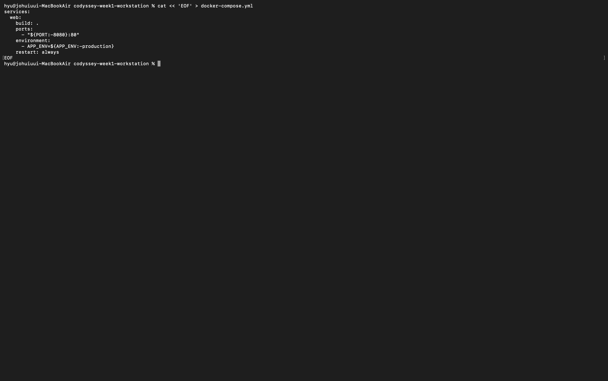

### 1-3. `.env` 환경 변수 파일 작성

1. CLI

```bash
cat << 'EOF' > .env
PORT=8082
APP_ENV=development
EOF
```

2. CLI 실행 화면
   

### 1-4. 실행 및 상태 확인

1. CLI

```bash
# 1. 컨테이너 백그라운드 구동 (up)
docker compose up -d --build

# 2. 실행 상태 확인 (ps)
docker compose ps

# 3. 로그 확인 (logs)
docker compose logs web

# 4. .env에서 설정한 8082 포트로 접속 확인
curl http://localhost:8082
```

2. CLI 실행 화면
   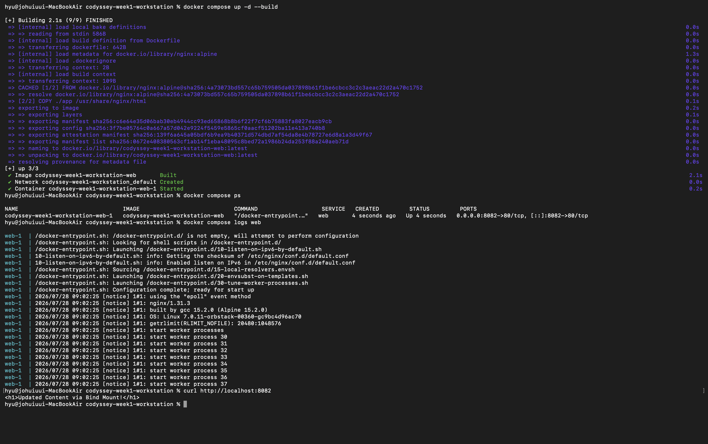

3. 실행 화면
   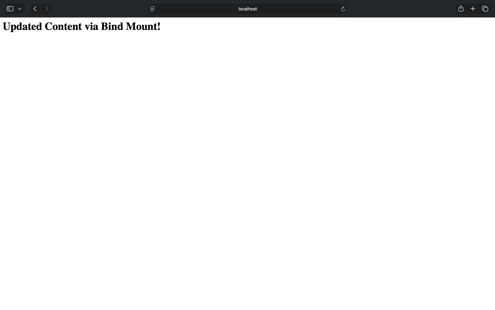

<br/>

## 2. Docker Compose 멀티 컨테이너 & 네트워크 통신

### 2-1. `docker-compose.yml` 업데이트: 멀티 컨테이너:

1. CLI

```bash
cat << 'EOF' > docker-compose.yml
services:
  web:
    build: .
    ports:
      - "${PORT:-8082}:80"
    environment:
      - APP_ENV=${APP_ENV:-development}
    depends_on:
      - redis
    networks:
      - app-net

  redis:
    image: redis:alpine
    container_name: my-redis
    ports:
      - "6379:6379"
    networks:
      - app-net

networks:
  app-net:
    driver: bridge
EOF
```

<details>
<summary>yml 파일 설명</summary>
<div>

```bash
cat << 'EOF' > docker-compose.yml
# 실행할 컨테이너(서비스) 목록

services:
# 첫 번째 서비스: 웹 서버
  web:
    # 현재 디렉토리(.)의 Dockerfile을 읽어 이미지를 직접 빌드함
    build: .

    # 포트 매핑 (호스트 포트 : 컨테이너 내부 포트)
    ports:
      - "${PORT:-8082}:80"

    # 컨테이너 내부 환경 변수 주입
    environment:
      - APP_ENV=${APP_ENV:-development}

    # 실행 의존성 (redis가 먼저 뜬 후 web을 실행)
    depends_on:
      - redis

    # app-net 네트워크에 참여
    networks:
      - app-net

# 두 번째 서비스: Redis 서버
  redis:
    # Docker Hub에서 가벼운 'redis:alpine' 공식 이미지를 다운로드하여 사용
    image: redis:alpine

    # 컨테이너 이름을 자동으로 짓지 않고 'my-redis'로 명시적 지정
    container_name: my-redis

    # Redis 기본 포트(6379)를 호스트의 6379 포트와 연결
    ports:
      - "6379:6379"

    # web 서비스와 동일한 app-net 네트워크에 참여
    networks:
      - app-net

# 2. 컨테이너들이 사용할 가상 네트워크 정의
networks:
    # 독립된 격리 가상 네트워크(bridge)를 생성
  app-net:
    driver: bridge
EOF
```

</div>

</details>

2. CLI 실행 화면
   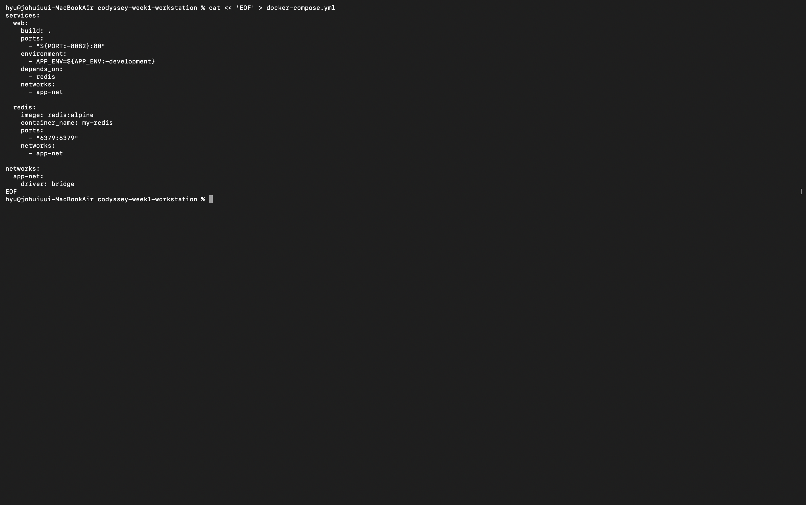

### 2-2. 실행 및 컨테이너 간 네트워크 통신 검증

1. CLI

```bash
# 1. 멀티 컨테이너 빌드 및 실행
docker compose up -d

# 2. 서비스 상태 확인 (web, redis 2개가 떠야 함)
docker compose ps

# 3. 네트워크 통신 검증 (web 컨테이너 안에서 서비스명 'redis'로 ping 전송)
docker compose exec web ping -c 2 redis
```

2. CLI 실행 화면

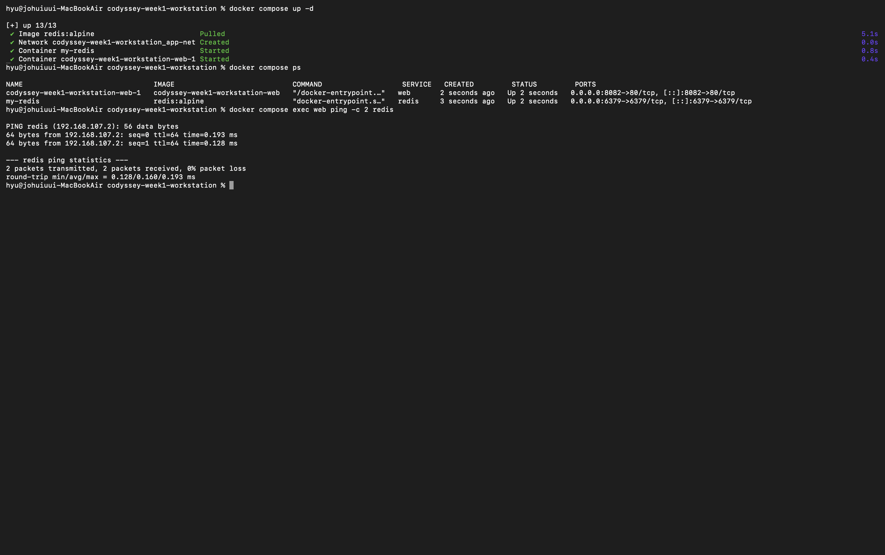

<div>
<b>서비스 디스커버리(Service Discovery)</b>

Docker Compose는 동일한 네트워크 안에서 서비스 이름(`redis`)을 도메인 이름처럼 활용해 내부 IP를 찾는다.

</div>

### 2-3. Compose 정리 (down)

1. CLI

```bash
# 컨테이너 및 브릿지 네트워크 정리
docker compose down
```

### CLI 실행 화면

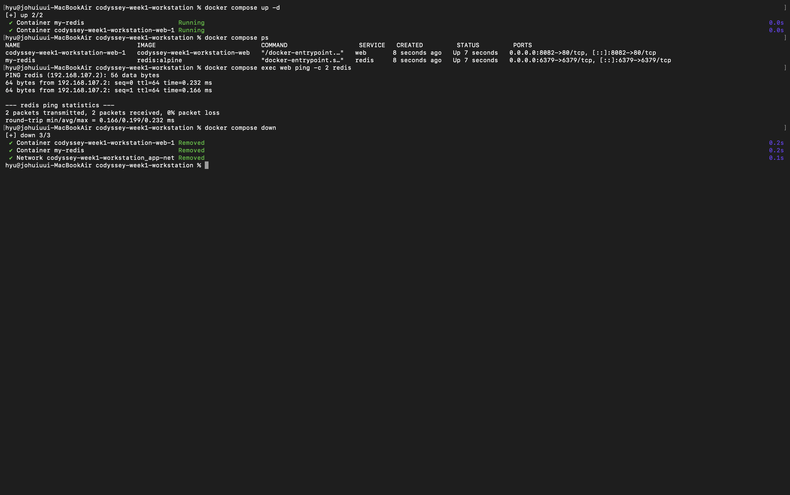

<br/>

## 3. Docker Compose 운영 및 상태 점검 명령어

### 3-1. 실행 (Deploy)

1. CLI

```bash
docker compose up -d
```

- `-d` (Detached mode): 컨테이너를 백그라운드에서 실행함. 터미널을 계속 사용할 수 있게함. 이미지가 없으면 빌드/다운로드부터 실행까지 일괄 처리.

2. CLI 실행 화면
   

### 3-2. 상태 확인 (Inspect)

1. CLI

```bash
docker compose ps
```

- 현재 관리 중인 모든 서비스의 상태를 한눈에 보여줌.
- STATUS가 Up인지 PORTS 매핑이 의도한 대로 되어 있는지 확인.

2. CLI 실행 화면
   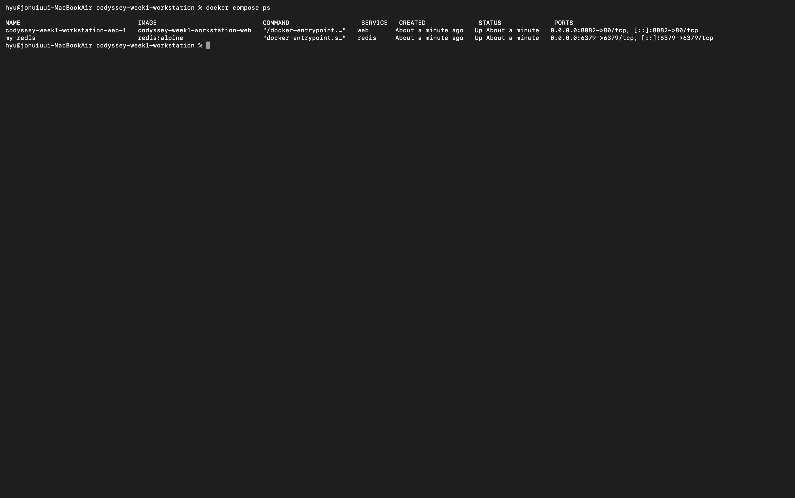

### 3-3. 로그 모니터링 (Debug)

1. CLI

```bash
docker compose logs -f --tail 100
```

- `-f` (Follow): 실시간으로 올라오는 로그를 계속 지켜봄.

- `--tail 100`: 너무 많은 이전 로그 대신 최신 100줄만 먼저 보여줌.

- 특정 서비스 로그만 보고 싶다면 끝에 이름 추가: `docker compose logs -f web`

2. CLI 실행 화면
   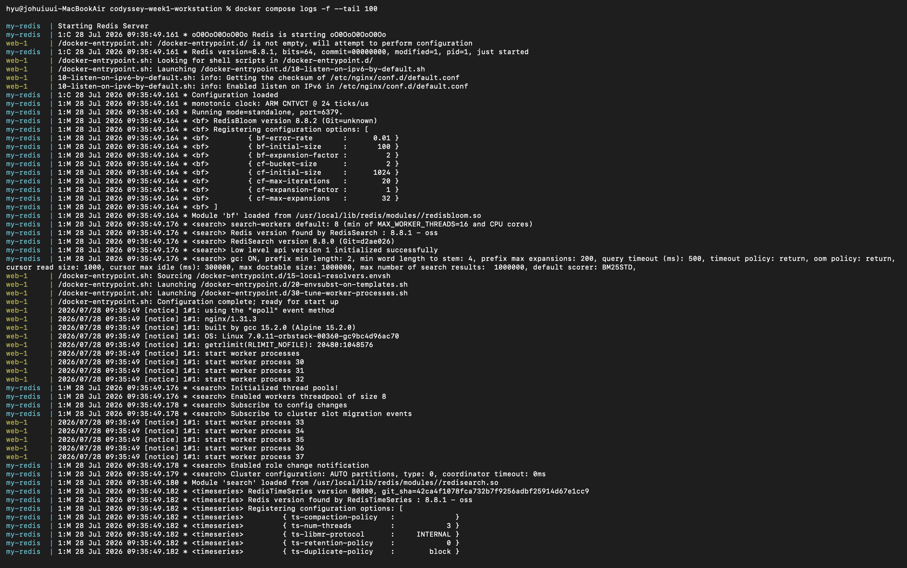

### 3-4. 종료 및 정리 (Cleanup)

1. CLI

```bash
docker compose down
```

- 컨테이너를 멈추고 삭제하며 생성했던 내부 네트워크까지 깔끔하게 지움.
- 데이터(볼륨)는 유지되지만 컨테이너 자체는 사라지므로 깨끗한 상태로 돌아갈 때 사용.

2. CLI 실행 화면
   

## 4. Docker & Compose 환경 변수 활용

### 4-1. 설정과 코드의 분리

소프트웨어 개발의 12가지 주요 원칙(12-Factor App) 중 하나는 `설정을 소스 코드에서 엄격히 분리`

[분리하지 않을 경우]

- 개발 디버깅용 포트와 실제 서비스 포트가 다를 때 매번 코드를 수정

- 비밀번호, API 키 등 민감 정보가 GitHub 저장소에 그대로 노출

### 4-2. 환경 변수가 주입 3단계 계층 구조

Docker 생태계에서는 다음 3가지 위치에서 환경 변수를 관리

| 주입 위치             | 작성 위치                 | 역할 및 유용성                                          |
| --------------------- | ------------------------- | ------------------------------------------------------- |
| 1) Dockerfile         | ENV APP_ENV=dev           | 기본값(Default)을 설정해 둠                             |
| 2) .env 파일          | PORT=9090                 | 호스트 환경별 설정을 키-값 형태로 관리함 (Git에서 제외) |
| 3) docker-compose.yml | environment: 또는 ${PORT} | .env에서 읽은 값을 컨테이너 내부로 최종 주입함          |

### 4-3. 포트 & 모드 변경

#### 4-3-1. env 파일 수정

[CLI]

```bash
cat << 'EOF' > .env
PORT=9090
APP_ENV=production
EOF
```

[CLI 실행 결과]


#### 4-3-2. Compose 재구동 (docker compose up -d)

[CLI]

```bash
docker compose up -d
```

[CLI 실행 결과]
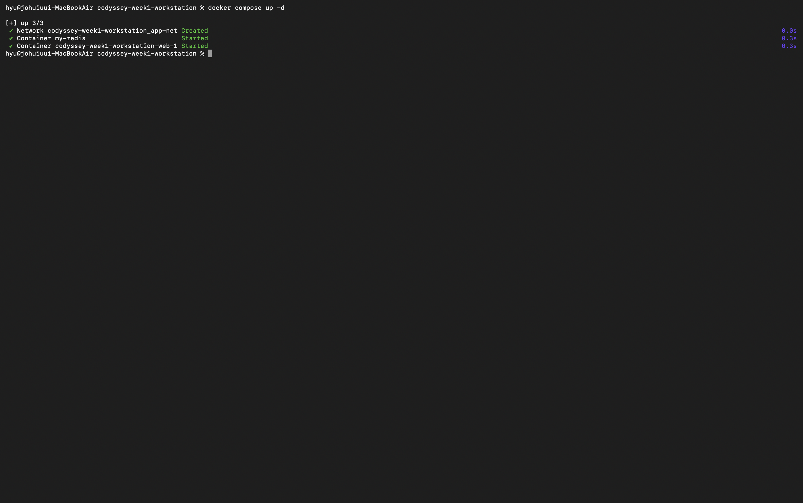

#### 4-3-3. 변경 결과

1. 외부 포트 변경 확인 (docker compose ps)

[CLI]

```
docker compose ps
```

[CLI 실행 결과]
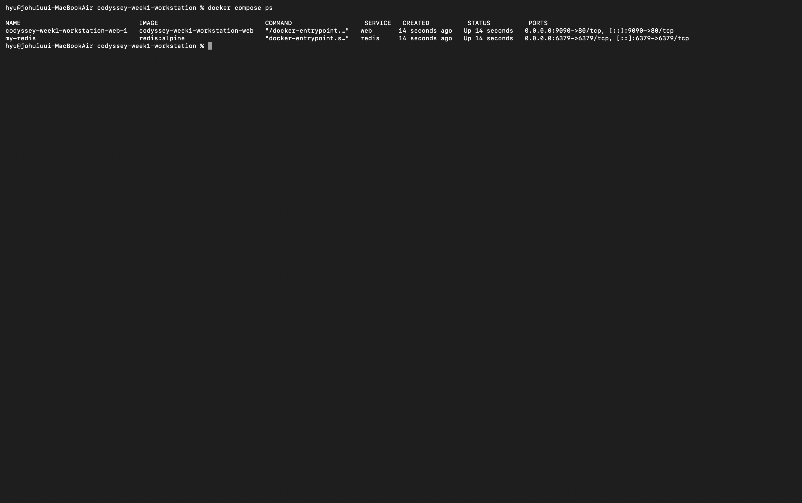

2. 컨테이너 내부 주입 환경 변수 확인 (docker compose exec)
   [CLI]

```bash
docker compose exec web printenv APP_ENV
```

[CLI 실행 결과]
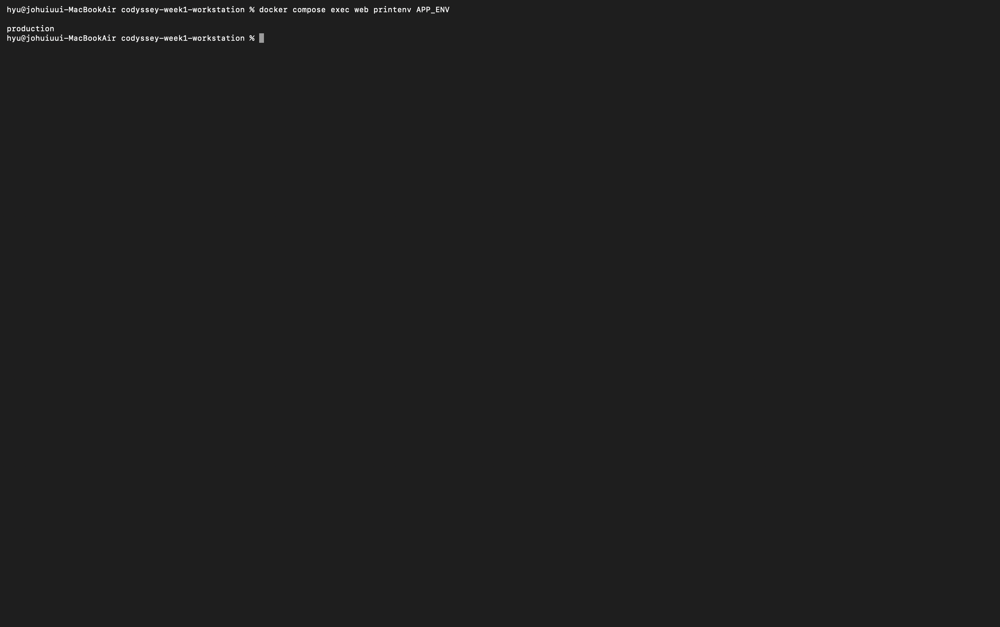

3. 접속 테스트

[CLI]

```
curl http://localhost:9090
```

[CLI 실행 결과]
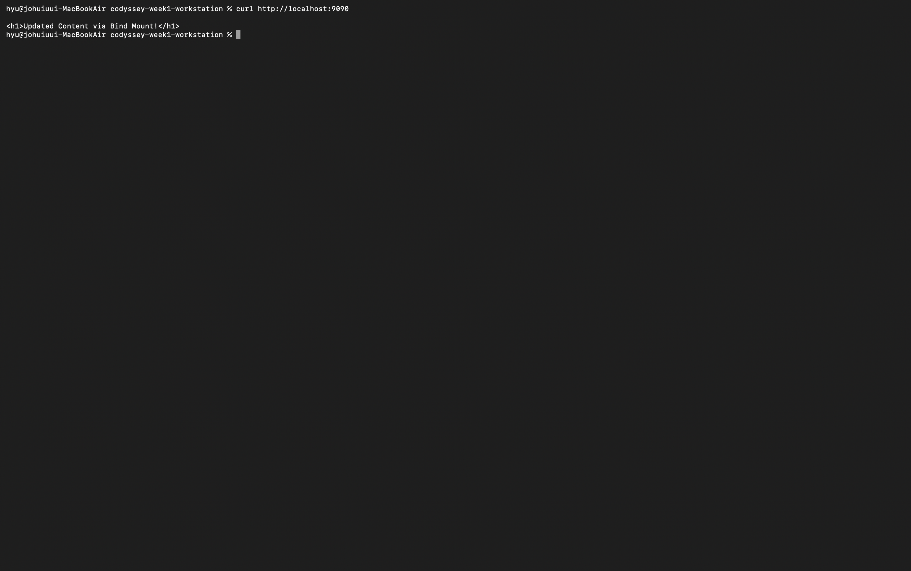

[실행 결과]
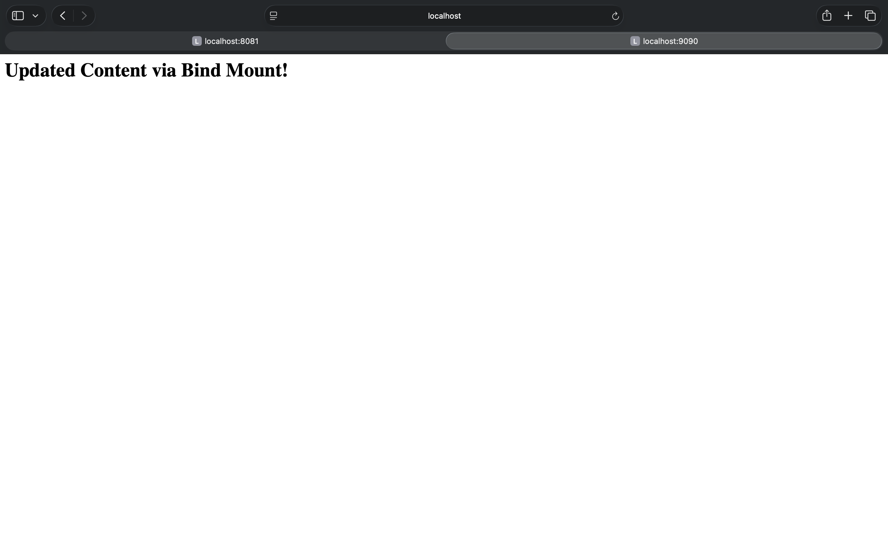

## 5. GitHub SSH 키 설정

### 5-1. HTTPS vs SSH 인증 방식 비교

| 구분      | HTTPS 인증 방식                               | SSH (Secure Shell) 인증 방식                           |
| --------- | --------------------------------------------- | ------------------------------------------------------ |
| 인증 방식 | 계정 비밀번호 또는 PAT(Personal Access Token) | 공개키(Public Key) - 개인키(Private Key) 쌍            |
| 편의성    | 토큰 만료 시 재발급 및 재입력 필요            | 최초 1회 등록 후 비밀번호 입력 없이 푸시 가능          |
| 보안성    | 토큰 유출 시 해당 토큰으로 직접 접근 가능     | 개인키는 내 PC에만 보관되며, 외부에 절대 노출되지 않음 |
| 주요 용도 | 단순 조회, 단발성 다운로드                    | 지속적인 개발, CI/CD 자동화 배포, 보안이 중요한 환경   |

### 5-2. SSH 키 설정 및 검증 실습

#### 5-2-1. 기존 SSH 키 존재 여부 확인

[CLI]

```bash
ls -al ~/.ssh
```

id_ed25519.pub 또는 id_rsa.pub 파일이 없다면 새 키를 생성

### 5-2-2. ED25519 SSH 키 생성

- ed25519 알고리즘: 최신 암호학 표준이자 빠른 속도와 높은 보안성을 제공

[CLI]

```bash

ssh-keygen -t ed25519 -C "GitHub_이메일@example.com"
```

[CLI 입력 안내]

```
Enter file in which to save the key: 엔터(Enter)를 입력하여 기본 경로(~/.ssh/id_ed25519) 사용

Enter passphrase: SSH 키용 비밀번호 설정 (필요 없으면 엔터 2번 눌러 건너뛰기)
```

[CLI 실행 결과]

`키 노출로 인하여 결과 사진 제외`

### 5-2-3. 공개키(Public Key) 복사

생성된 공개키(id_ed25519.pub) 내용을 터미널에 출력하거나 클립보드에 복사

```bash
# macOS 클립보드 바로 복사 명령어
pbcopy < ~/.ssh/id_ed25519.pub

# 또는 터미널에 출력된 내용을 직접 드래그하여 복사
cat ~/.ssh/id_ed25519.pub
```

```
주의
.pub 확장자가 붙은 공개키만 복사하기!
확장자가 없는 id_ed25519(개인키)는 절대로 외부에 노출 금지
```

### 5-2-4. GitHub에 SSH 공개키 등록

1. GitHub.com 로그인

2. 우측 상단 프로필 아이콘 ➔ Settings 클릭

3. 좌측 메뉴의 Access 섹션 ➔ SSH and GPG keys 클릭

4. New SSH key 버튼 클릭

5. 입력란 채우기

```
Title: MacBook Air (OrbStack) 등 내 PC를 구분할 이름

Key type: Authentication Key

Key: 복사한 ssh-ed25519 AAAAC3NzaC... 내용 붙여넣기
```

5. Add SSH key 버튼 클릭하여 저장

[실행 결과]

`키 노출로 인하여 결과 사진 제외`

### 5-2-5. SSH 접속 연동 테스트

[CLI]

```bash
ssh -T git@github.com
```

[최초 접속 시 확인 메시지]

```
Are you sure you want to continue connecting (yes/no/[fingerprint])? ➔ yes 입력
```

[성공 메시지 출력 확인]

```
Hi <GitHub_사용자명>! You've successfully authenticated, but GitHub does not provide shell access.
```

[CLI 실행 화면]
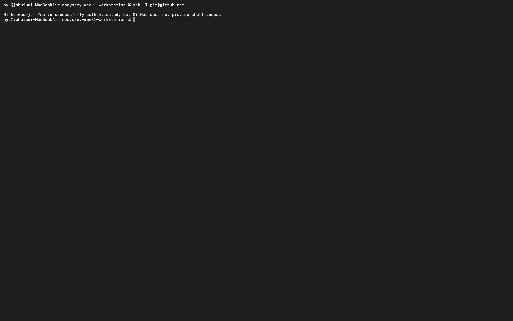

### 5-2-6. Git 원격 저장소 URL을 HTTPS에서 SSH로 변경

1. 현재 설정된 원격 저장소 URL 확인
   git remote -v

2. SSH URL로 변경
   git remote set-url origin git@github.com:username/repository-name.git

3. 변경된 URL 확인
   git remote -v

[변경 확인]
아래 형태로 보이면 성공

```
origin git@github.com:username/repository-name.git (fetch)
```

[CLI 실행 화면]
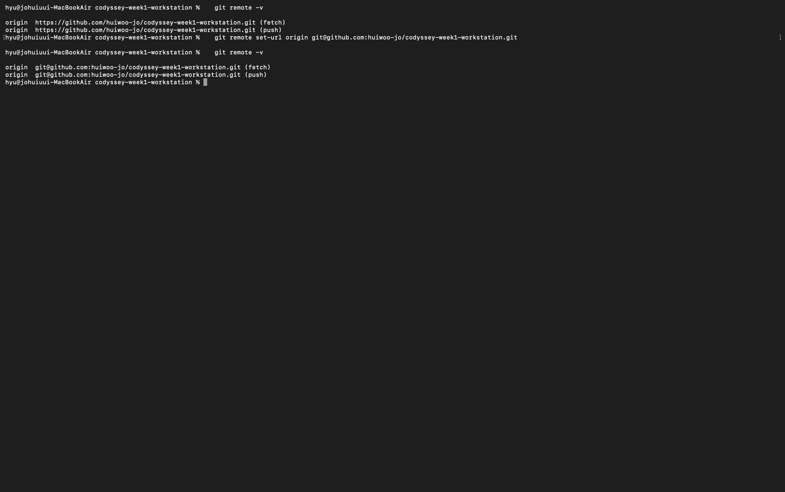
